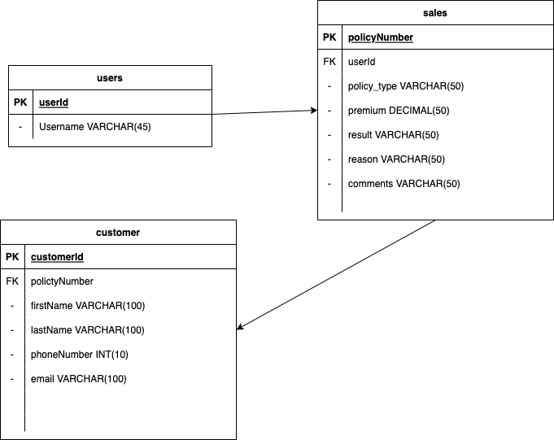

# Individual-Sales-Tracker
### By: Gisel Urena, Kyle Kalantzis, Paige Lyle, Tylus Dawkins
## Description
This is an application for tracking an insurances sales metrics on an individual level using a data analytics display and insights for future performance.
***
## Technologies Used
### Front-End
React
HTML
CSS
Javascript
Bootstrap/Tailwind

### Back-End
Java
JUnit
MySQL
***
## Planning
### Wireframe of Dashboard

### ERD

